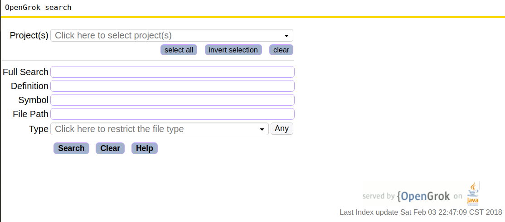

## Introduction

MyOpenGrok是基于[OpenGrok](http://oracle.github.io/opengrok/)的源代码搜索工具,通过提取关键代码而形成一个提供源代码搜索API接口.


## Requirement

### 1.安装opengrok：
具体可以参照：http://blog.csdn.net/jeffyin_wh/article/details/21465323

### 2.验证是否安装成功：
启动tomcat，在浏览器访问：http://localhost:8080/source ，如果展示了下面的页面，就说明安装成功了。

### 3.使用opengrok对项目建立索引

**注意:如果想要对某个项目使用MyOpengrok的功能,首先必须对这个项目建立索引!!,如果新添加了一个项目,记得一定要对这个项目建立索引!!!**

进入opengrok的根目录，在命令行执行：

```
java -Xmx524m -jar lib/opengrok.jar -W "<opengrok-home>/data/configuration.xml" -P -S -v -s "<project-path>" -d "<opengrok-home>/data"
```

其中<opengrok-home>代表opengrok的根目录,<project_path>为需要建立索引的项目的路径，如果指定的路径下包含多个项目，那么OpenGrok会对每一个项目都建立索引，并存储在不同的文件夹中。

opengrok建立索引的方式是增量建立，也就是如果之前已经对某个项目建立了索引，下一次如果<project_path>中包含了该项目，建立索引时会跳过该项目。

**一般情况下我们会将所有的项目全部放在<opengrok-home>/source下面,而如果添加了一个新项目,只需要这样执行以下的命令:**

```
java -Xmx524m -jar lib/opengrok.jar -W "<opengrok-home>/data/configuration.xml" -P -S -v -s "<opengrok-home>/source" -d "<opengrok-home>/data"
```

## Usage
### 1.获取项目中文件的内容：

在opengrok中,如果想要查看code-reading/src/main/java/com/codeReading/config/ElasticsearchConfig.java文件的内容,可以通过访问:http://localhost:8080/xref/code-reading/src/main/java/com/codeReading/config/ElasticsearchConfig.java, 而MyOpengrok既保留了这种访问方式,而且,**如果只想获取文件的内容,可以将上面url中的xref替换为myxref即可.**

### 2.获取文件的navigation内容

首先所谓的navigation也就是文件的一些重要的内容,由三个部分组成:class,package,method,如果我想获取code-reading/src/main/java/com/codeReading/config/ElasticsearchConfig.java文件的Navigation的内容,可以通过访问:http://localhost:8080/navigation/code-reading/src/main/java/com/codeReading/config/ElasticsearchConfig.java ,(其实跟上面的方式类似,只是将xref替换为了navigation而已),**返回值如下所示:**

```
["Class","xc",[["ElasticsearchConfig",19]]],["Package","xp",[["com.codeReading.config",1]]],["Method","xmt",[["searchOperator",24],["transportClient",29]]]
```

返回值的意思就是文件的Class名为ElasticsearchConfig,在文件的第19行,第二个参数"xc"一般用不上,(它是opengrok中html中的class属性).

### 3.按关键字搜索

在opengrok中,搜索可以如果想要只在jdk1.8这个项目下搜索defs=Date的项,可以在浏览器访问:

http://localhost:8080/search?project=jdk1.8&defs=Date

如果想要在jdk1.8和code-reading这两个项目下搜索defs=Date的项,可以这么访问:

http://localhost:8080/search?project=jdk1.8&project=code-reading&defs=Date

而在MyOpenGrok中,**只要将search替换成mysearch,那么就会将搜索到的结果以json字符串的形式返回.**,返回值如下所示(只截取了部分):

```
"defs":"Date","duration":20,"resultcount":138,"results":[{"path":"\/jdk1.8\/src\/java\/sql\/Date.java","filename":"Date.java","lineno":"38","line":"ICogbWlsbGlzZWNvbmQgdmFsdWVzIHdyYXBwZWQgYnkgYSAmbHQ7Y29kZSZndDtqYXZhLnNxbC48Yj5EYXRlPC9iPiZsdDsvY29kZSZndDsgaW5zdGFuY2U=","directory":"\\\/jdk1.8\\\/src\\\/java\\\/sql"},...]
```

返回值中,duration的值表示搜索所花费的时间,单位为毫秒, resultcount表示结果的个数,在result中,**值得注意的是line对应的是代码,已经被Base64编码了,如果要获取代码的具体内容,应该先用base64解码**


## ChangeLog

v0.1 提交了SourceColon版本,对于获取文件的内容,文件的Navigation都没有问题,但是对于搜索存在部分问题.另外,执行SourceColon并不方便,有待改进

v0.2 删除了SourceColon版本,提交MyOpenGrok,基本上满足了所有的功能:1.获取文件的内容; 2.获取文件的Navigation内容; 3.搜索功能,关键字搜索,指定只在某几个项目中搜索


